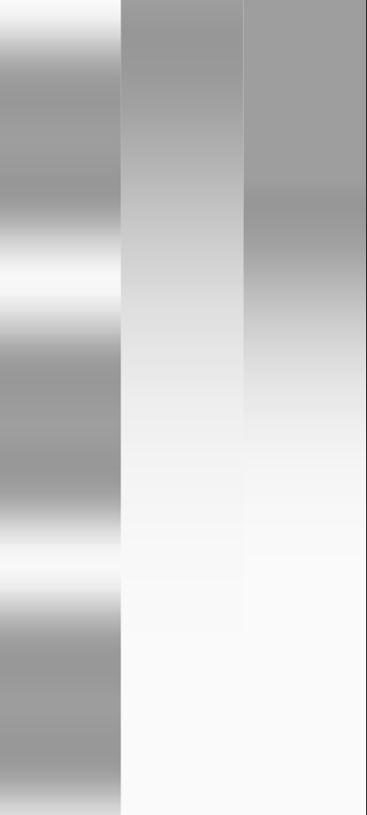

Generate a gradient using a custom curve function.




## Usage

```dart
Container(
  decoration: BoxDecoration(
    gradient: CurvedGradient(
      begin: Alignment.topCenter,
      end: Alignment.bottomCenter,
      colors: [Colors.grey, Colors.transparent],
      granularity: 10,
      curveGenerator: (x) => pow(sin(x * 10), 2).toDouble(),
    ),
  ),
)
```
